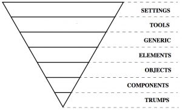

## Sobre o projeto

Este é um projeto simples que apresenta uma única página com uma listagem de vagas na Elo7.
O objetivo do projeto é fornecer uma interface amigável e fácil de usar para visualizar e filtrar vagas disponíveis.

[Case](https://gist.github.com/elo7-developer/33a0844a9ac6953dd3e5)  
[Design](<https://www.figma.com/design/ZE47ZfsfFpoDxKXxyDt9mu/Case-Front-End-(Copy)?node-id=0-1&t=HivniUDBE21WtOQa-1s>)

## 📝 Tabela de conteúdos

- [Tecnologias Utilizadas](#%EF%B8%8F-tecnologias-utilizadas)
- [Como executar o projeto](#point_right-como-executar-o-projeto)
- [Estrutura do Projeto](#mag_right-estrutura-do-projeto)
- [Melhorias](#-melhorias)

## ⛏️ Tecnologias Utilizadas

- **Next.js**: Framework de React para desenvolvimento de aplicações web.
- **TypeScript**: Linguagem de programação para tipagem estática de dados.
- **SASS**: linguagem de extensão do CSS para desenvolvimento de estilos.
- **Plaiceholder**: Biblioteca para geração de placeholders de imagem.

### Testes:

- **Jest**: Framework usado para testes unitários.
- **Cypress**: Ferramenta de teste de interface de usuário para testes de integração e end-to-end.

### Ferramentas de Desenvolvimento:

- **Prettier**: Ferramenta para formatação de código.
- **ESLint**: Ferramenta para análise estática de código em JavaScript e TypeScript.

## :point_right: Como executar o projeto

1. Instale as dependências do projeto:

   ```sh
   npm install
   ```

2. Execute a aplicação:

   ```sh
   npm run dev
   ```

3. Para executar os testes unitários:

   ```sh
   npm run test
   ```

   ou para executar seus testes a cada mudança feita:

   ```sh
   npm run test:watch
   ```

4. Para executar os testes end-to-end:
   ```sh
   npm run cypress:open
   ```

Abra [http://localhost:3000](http://localhost:3000) no seu browser para ver a aplicação.

## :mag_right: Estrutura do Projeto

A aplicação segue uma estrutura de código organizada e modular, facilitando a manutenção e extensão do projeto. Aqui está uma visão geral da estrutura do diretório:

```sh
/
├── 📂 cypress/
├── 📂 public/
├── 📂 src/
│   ├── 📂 __tests__/
│   ├── 📂 app/
│   ├── 📂 components/
│   ├── 📂 constants/
│   ├── 📂 hooks/
│   ├── 📂 lib/
│   ├── 📂 services/
│   ├── 📂 styles/
│   │   ├── 📂 elements
│   │   │   ├── 🟪 _typography.scss
│   │   │   └── ...etc
│   │   ├── 📂 generic
│   │   │   ├── 🟪 _reset.scss
│   │   │   └── ...etc
│   │   ├── 📂 objects
│   │   │   ├── 🟪 _grid.scss
│   │   │   └── ...etc
│   │   ├── 📂 settings
│   │   │   ├── 🟪 _colors.scss
│   │   │   └── ...etc
│   │   ├── 📂 tools
│   │   │   ├── 🟪 _breakpoints.scss
│   │   │   └── ...etc
│   │   └── 🟦 main.scss
│   ├── 📂 types/
│   ├── 📂 utils/
├── ⬜ cypress.config.ts
├── ⬜ jest.config.ts
├── ⬜ next.config.ts
├── ⬜ README.md
```

### Descrição das pastas

#### `/cypress`

Esta pasta contém os testes de integração e end-to-end escritos com Cypress, uma ferramenta de automação de testes.

#### `/public`

Contém os arquivos estáticos da aplicação, como ícones e imagens.

#### `/src`

- **`/__tests__`**: Contém os testes unitários dos componentes.

- `/app`: Contém o componente principal da aplicação, onde ficam estruturadas as páginas e rotas da API e sua inicialização.

- `/components`: Contém componentes reutilizáveis da aplicação.

- `/constants`: Contém constantes utilizadas em todo o projeto.

- `/hooks`: Contém custom hooks reutilizáveis em vários componentes.

- `/lib`: Contém bibliotecas e módulos auxiliares utilizados no projeto.

- `/services`: Contém serviços responsáveis pela lógica de negócio e integração com APIs.

- `/styles`: Esta pasta é organizada de acordo com o padrão ITCSS ([clique aqui para saber mais sobre essa arquitetura](https://imasters.com.br/arquitetura-da-informacao/arquitetura-css-itcss)), que facilita a manutenção e escalabilidade dos estilos CSS.

  

  - `settings`: Contém variáveis e configurações globais.  
    **Exemplo**: \_colors.scss: Definições de cores.

  - `tools`: Contém mixins, funções e ferramentas de SASS.  
    **Exemplo**: \_breakpoints.scss: Definições de breakpoints para responsividade.

  - `generic`: Contém estilos globais e genéricos aplicados em toda a aplicação.  
    **Exemplo**: \_reset.scss: Estilos de reset para normalizar os estilos dos navegadores.

  - `elements`: Contém estilos básicos de elementos HTML.  
    **Exemplo**: \_typography.scss: Estilos de tipografia.

  - `objects`: Contém estilos de layout e estrutura da aplicação.  
    **Exemplo**: \_grid.scss: Estilos de grid.

  - main.scss: Arquivo principal que importa todos os estilos necessários para o tema base.

- `/types`
  Contém definições de tipos TypeScript utilizadas em todo o projeto.

- `/utils`
  Contém funções utilitárias e helpers usados em toda a aplicação.

- `Outros Arquivos`
  - cypress.config.ts: Arquivo de configuração do Cypress.
  - jest.config.ts: Arquivo de configuração do Jest.
  - next.config.ts: Arquivo de configuração do Next.js.

## 🔨 Melhorias

- Adicionar dados estruturados na estruturação da página, tais como [Job Posting](https://developers.google.com/search/docs/appearance/structured-data/job-posting), [Estimated salary](https://developers.google.com/search/docs/appearance/structured-data/estimated-salary) e [Breadcrumb](https://developers.google.com/search/docs/appearance/structured-data/breadcrumb).
- Para melhorar o carregamento dos ícones no mobile e em alguns browsers, pode ser criado uma sprit com os ícones
